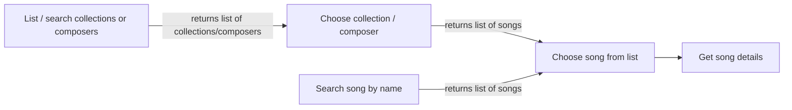

# API authentication
GraphQL queries need no authentication. Mutations, on the other hand, require that a hashed superuser token is stored in the DB, and that the token is provided in the request headers with `Authorization: Bearer <token>`.

# DynamoDB design documentation

## Background
The db was migrated from postgresql to DynamoDB because:
1. RDS is expensive beyond free-tier, due to which the DB had already been migrated to an EC2 instance
2. The EC2 instance was a pain to manage
3. DynamoDB is practically free, as the volume is negligible 
4. DynamoDB being nosql, it was a fun learning challenge
5. Setup with other AWS services was relatively straightforward

It may well be that the backend will be migrated to a traditional SQL database later, but for now, here's a rundown of the design of the current implementation.

## Table design
In DynamoDB, each record contains a Partition Key and a Sort Key which form the Primary Key for the record, as well as other attributes. (Technically you can omit the Sort Key, but we don't). The Partition Key and Sort Key are also known as Hash Key and Range Key, respectively.

There different _kinds_ of records in the DB:

- song
- collection
- composer
- membership
- opus
- sequence
- metadata
- token

For every record _except for the membership records_ you can discern the kind of record from the partition key. E.g. for _songs_ the partition key is `song` 

### Song, collection and composer records
These are considered the main record types. They share the following fields:
- pk - e.g. `song` for songs, etc.
- sk - e.g. `song:1`
- name
- search_name - a lower case version of name
- random - a randomly generated number for the purpose of fetching a random record

Additional fields:
- songs
  - tones - e.g. `D4-Bb3-F3-Bb2`
- composers
  - first_name - can be null
  - last_name
  - (the name field on a composer is `<last_name>, <first_name>`)

### Membership records
Membership records implement many-to-many relationships from songs to composers and collections.
Fields:
- pk - the sk of the collection or composer, e.g.`composer:1`
- sk - the sk of the song, e.g. `song:1`
- name - the name of the song
- tones - the tones of the song

### Token records
Token records are meant for user authentication. Currently only for superuser access.

### Opus records
Opus records contain the sound files or the starting tones. Each unique* set of tones results in exactly one record, which is used for any song starting with the particular tones.
Fields:
- pk is `opus`
- sk is the tones, e.g. `D4-Bb3-F3-Bb2`
- opus - the sound file itself, as binary data in base64.

_* not considering enharmonics, at the moment._

### Sequence records
The sequence records are [atomic counters](https://aws.amazon.com/blogs/database/implement-resource-counters-with-amazon-dynamodb/) which provide sequential integers for use with partition and sort keys. Essentially, they do what an autoincreasing primary key does in an SQL database. They are used when creating new songs, composers and collections: they provide the numeric part of the sk of these records (e.g. song:_100_). The values are increasing, but not necessarily sequential, i.e. observing records, the sk:s can "jump" from e.g. `song:200` to `song:202`. This is because upon deleting records, the sequence is not reset. There are separate sequences for songs, collections, and composers.
Fields:
- pk is `sequence`
- sk e.g. `composer_id`
- current_value - an integer that is at least as large as the largest sk of the corresponding record kind.

### Metadata records
Currently contains the "table version" which is mainly used in data migrations. Basically key-value pairs
Fields:
- pk is `metadata`
- sk is the key. Currently only `table_version`
- value

### Indices and querying
In DynamoDB, data can only be retrieved via full-table scans or querying along indices. The primary key (PK + SK) form one index, and additional, secondary indices can be created:
- Local secondary indices, which have the same partition key as the table itself, but have a different sort key
- Global secondary indices, which have a different partition key as the table

Indices in the current table design:
- search_index - a local secondary index with search_name as the sort key
  - allows searching for songs, collections and composers by (search_)name
- random_index - a local secondary index with random as the sort key
  - allows fetching a random song, collection or composer
- reverse_index - a global secondary index with sk as the partition key and pk as the sort key
  - allows particularly finding the membership records of a song. Used in cascading updates and deletes.

Here is a visualization of the typical use pattern(s) of a user of the Telegram bot: 

Queries for the cases above:
- List / search for collections or composers
    - Use Partition Key to get all collections or composers
    - Use search_index if filtering is needed
- Choose collection / composer
    - Use Partition Key and Sort Key to get specific composer / collection
    - User Partition Key e.g. `composer:n` to get composer's membership records   
- Search song by name
  - Use search_index
- Get song details (tones, opus)
  - Use Partition Key and Sort Key to get specific song record
  - With the tones from the point above, use the Partition Key to constrain to opus records, and the Sort Key to constrain to the specific record needed
