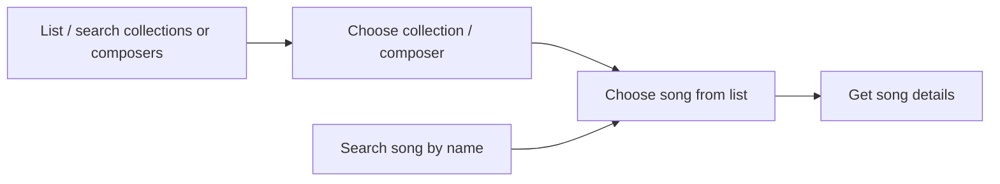

# DynamoDB design documentation

## Background
The db was migrated from postgresql to DynamoDB because:
1. RDS is expensive beyond free-tier, due to which the DB had already been migrated to an EC2 instance
2. The EC2 instance was a pain to manage
3. DynamoDB is practically free, as the volume is negligible 
4. DynamoDB being nosql, it was a fun learning challenge
5. Setup with other AWS services was relatively straightforward

It may well be that the backend will be migrated to a traditional SQL database later, but for now, here's a rundown of the design of the current implementation.

## Table design
In DynamoDB, each record contains a Partition Key and a Sort Key which form the Primary Key for the record, as well as other attributes. (Technically you can omit the Sort Key, but we don't). The Partition Key and Sort Key are also known as Hash Key and Range Key, respectively.

In addition to Partition and Sort Keys, every record in our table has a separate `type` attribute, which is one of the following:

- song
- collection
- composer
- membership
- opus
- sequence

The `type` is used in a secondary index for reasons of querying, which are discussed [later](#indices-and-querying) 

### Song, collection and composer records
The "main" record types are similar in structure: their `type` is _song,collection_ and _composer_, respectively, and their Partition Key is _\<type>:id_, e.g. _song:1_. They all have a Sort Key like _name:\<string>_ as well as a separate `name` attribute. The SK is typically a lowercase version of the `name` attribute, which makes certain queries simpler. 

Additionally, the song records have a field `tones` (e.g. _D4-Bb3-F3-Bb2_), and the composer records have `first_name` and `last_name` fields.

### Membership records
Membership records implement many-to-many relationships from songs to composers and collections. Their Partition Key is the PK of the "grouping", i.e. composer or collection id (e.g. _collection:1_), whereas the SK is the song id (e.g. _song:1_). Their type is "collection". Additionally, they have a `name` attribute which contains the name of the song - this allows a user to easily retrieve the names of songs belonging to a specific collection (the opposite is possible with a secondary index).

### Opus records
Opus records contain the sound files or the starting tones. Their Partition Key and type is "opus" for all records. The Sort Key is a text representation of the tones themselves, e.g. _D4-Bb3-F3-Bb2_; each unique* set of tones results in exactly one opus record, which is then used for any song starting with the particular tones.

The data itself is in field `opus`, and is binary data in base64.

_* not considering enharmonics, at the moment._

### Sequence records
The sequence records are [atomic counters](https://aws.amazon.com/blogs/database/implement-resource-counters-with-amazon-dynamodb/) which provide sequential integers for use with partition and sort keys. Essentially, they do what an autoincreasing primary key does in an SQL database.

There are separate sequences for songs, composers and collections (opus and membership records do not need them). Each of the sequences "holds" a numerical value that is at least as large as the largest value found in the corresponding records' id's. E.g. if the latest song has an PK of _song:123_ the value of the sequence would be greater than or equal to 123. When the next song is added, the sequence value is first incremented with an atomic write, and the new value returned to the user (see `/graph/crud.py` for implementation), which is then used to create the PK for the record. (As a side note, if the value is never used, the sequence does not get "reset" back - hence the sequence value is always _greater than_ or equal to the maximum observed value).

### Indices and querying
In DynamoDB, data can only be retrieved via full-table scans or querying along indices. The primary key (PK + SK) form one index, and additional, secondary indices can be created:
- Local secondary indices, which have the same partition key as the table itself, but have a different sort key
- Global secondary indices, which have a different partition key as the table

Our table has a global secondary index named `LookupIndex`, which has the field `type` as the partition key (sort key is the same as the table's).

Here is a visualization of the typical use pattern(s) of a user of the Telegram bot: 

Queries for the cases above:
- list or search for collections or composers
    - Use LookupIndex to constrain to type = collection/composer
    - If necessary, use Sort Key to filter by name
- choose collection / composer
    - Use Partition Key to constrain to specific composer
    - Use Sort Key with `"begins_with('song')"` to constrain to membership records.
    - (since membership records have the song names, this can be shown to the user)  
- search for songs by name
  - Use LookupIndex to constrain to type = song
  - Use Sort Key to filter by name
- display details of song (tones, opus)
  - Use Partition Key to get the song details (which includes tones)
  - With the tones from the point above, use the Partition Key to constrain to opus records, and the Sort Key to constrain to the specific record needed
